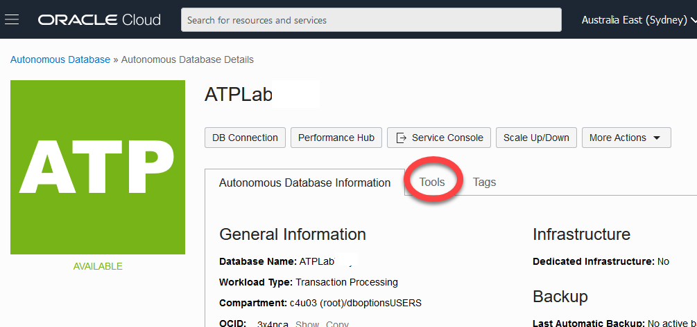
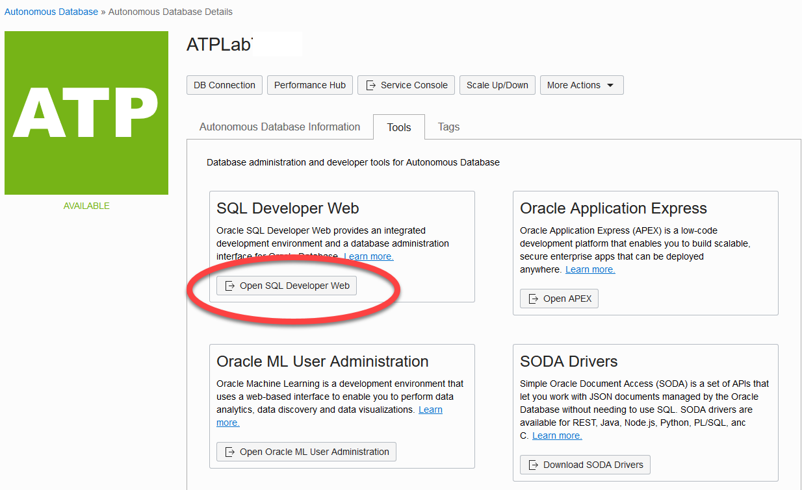
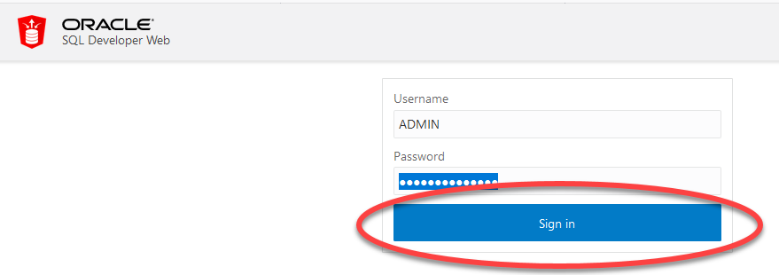

# introduction
Included with Oracle REST Data Services, Oracle SQL Developer Web is the web-based version of Oracle SQL Developer that enables you to execute queries and scripts, create database objects, build data models, and monitor database activity.

Oracle SQL Developer Web runs in Oracle REST Data Services and access to it is provided through schema-based authentication. To use Oracle SQL Developer Web, you must sign in as a database user whose schema has been enabled for SQL Developer Web.

In Oracle Autonomous Database databases, the ADMIN user is pre-enabled for SQL Developer Web.

## Step 1 Connect to your Autonomous Database using SQL Developer Web

1. From the ADB Details page, select the Tools tab

2. The Tools page provides you access to SQL Developer Web, Oracle Application Express, and Oracle ML User Administration. In the SQL Developer Web box, click *Open SQL Developer Web*.

3. A sign in page opens for SQL Developer Web. Sign in with the database instance's default administrator account, ADMIN, with the admin password you specified when creating the database. Click Sign in.

4. SQL Developer Web opens on a worksheet tab. The first time you open SQL Developer Web, a series of pop-up informational boxes introduce the main features.

## Conclusion
 You are now connected to your Autonomous Database using SQL Developer Web .

## Acknowledgements

 - **Author** - Troy Anthony, May 2020
 - **Last Updated By/Date** - Troy Anthony, May 20 2020

  See an issue?  Please open up a request [here](https://github.com/oracle/learning-library/issues).   Please include the workshop name and lab in your request.
