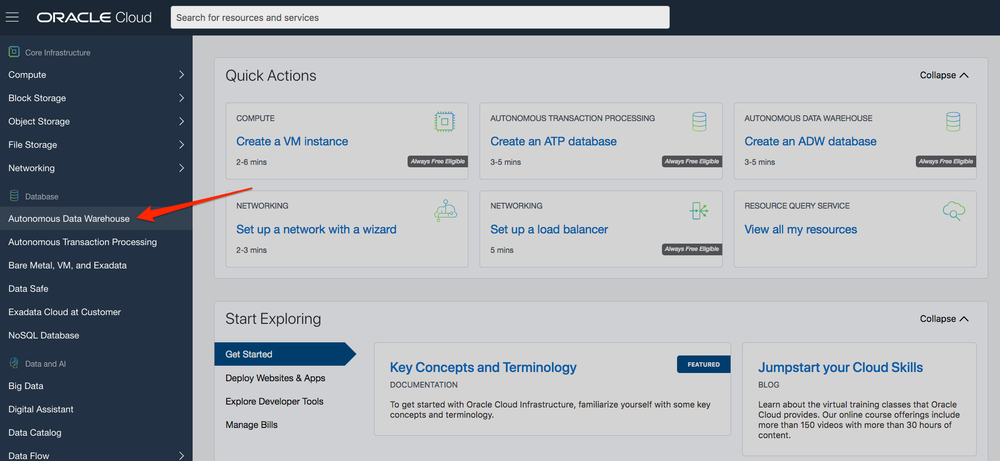
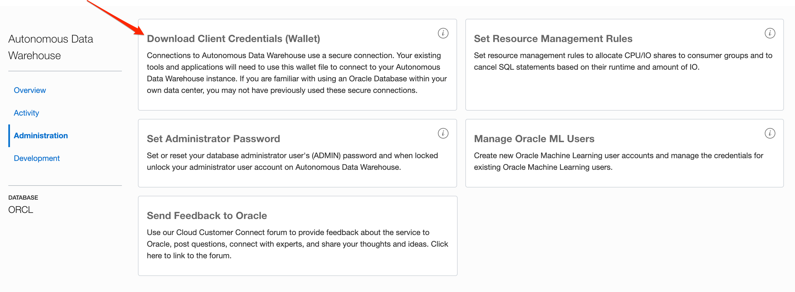
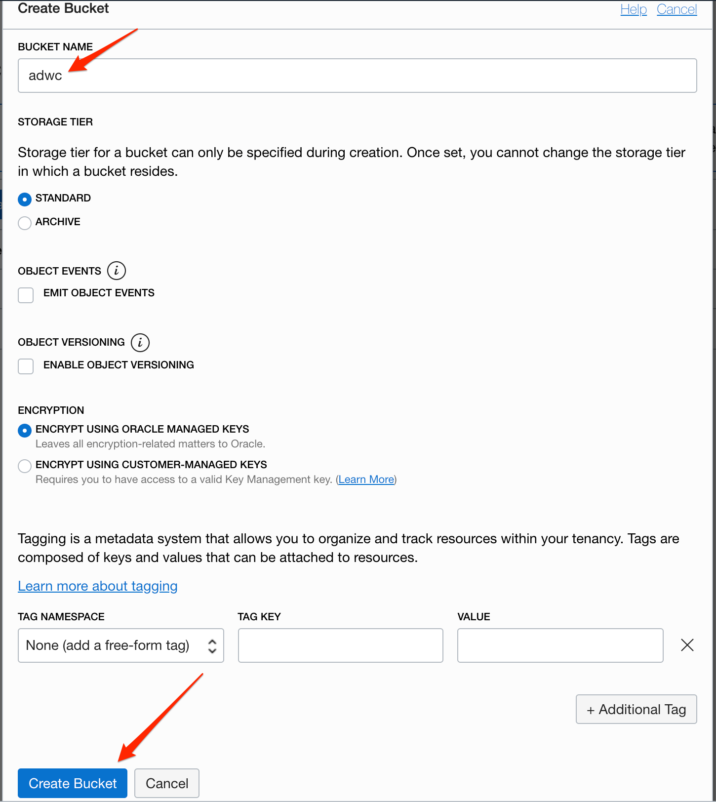
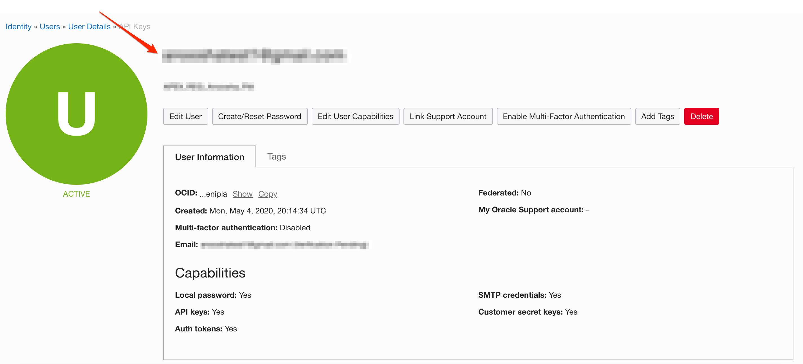
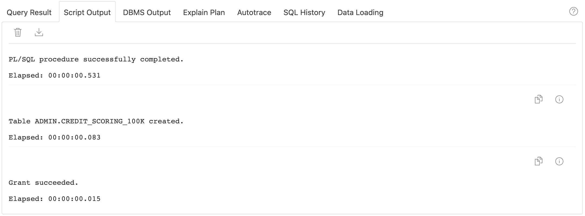

# Provision and Setup #

## Introduction ##

This lab is all about getting your environment set up correctly. Here we will show you how to provision two different autonomous database instances, load data into object storage, and set up credentials and tools.

### About Oracle Machine Learning

Simplifying greatly, you can split machine learning into two parts: the process of building and training a model so it is ready to work; putting that model to work in production systems, applications, and processes. In general, training a machine learning model takes significant computing resources. You should not run that kind of work in an existing data warehouse or data mart, without clearing it ahead of time because it’s possible that model training could use too many resources and impact SLAs. You definitely don’t want to build and train a model in any kind of critical transactional system for the same reason.

For this Alpha Office scenario, we provision two different autonomous databases. The autonomous data warehouse is used to build and train your model. Think of it as a stand-in for your own data warehouse or data mart. Alternatively, given how easy it is to provision a data mart, think of this ADW as the best way for you to do machine learning without impacting anybody else in the organization. Setting up a dedicated data mart for machine learning maybe the right thing for you to do outside of this lab.

But it’s not just about training the model - you also have to deploy it, and there are some options. You could deploy a model into a data warehouse where it’s available for analytics. Or maybe you want to deploy it into a production transaction processing system so that you can score each new transaction. Either way, you are going to need to know how to export and import a model. So we show you that in this lab using two different databases.

What Alpha Office wants is to deploy this machine learning model in a production database that supports their Client Service application. When an existing customer comes into the branch, we can pull up their name and check their credit in real-time. The marketing department can also load batch data into this system and run a process to score a new set of customers in bulk. So, this setup of just two different services allows you to build, train, and deploy a machine learning model into an application so that customer-facing and marketing employees can work with it.

### Objectives
-   Learn how to provision an ADW instance
-   Learn how to provision an ATP instance
-   Learn how to connect to ADW

### Lab Prerequisites

This lab assumes you have completed the following labs:
* Login to Oracle Cloud

*Note: You may see differences in account details (eg: Compartment Name is different in different places) as you work through the labs. This is because the workshop was developed using different accounts over time.*

In this section, you will be provisioning an ADWC database and an ATP database using the cloud console.

## Step 1: Create an ADW Instance

First, we are going to create an ADW Instance.

1.  Click the hamburger menu, search for **Autonomous Data Warehouse**, and click on it.

    


2.  Select **Create Autonomous Data Warehouse**.

    

3.  Select **Compartment** by clicking on the drop-down list. (Note that yours will be different - do not select **ManagedCompartmentforPaaS**) and then enter **Display Name**, **Database Name**.

    

4.  Under **Choose a workload type** and **Choose a deployment type**, select **Data Warehouse**, and **Shared Infrastructure** respectively.

    

5.  Under **Configure the database**, leave **Choose database version** and **Storage (TB)** and **OCPU Count** as they are.

    

6.  Add a password. Note the password down in a notepad, you will need it later in Lab 2.

    

7.  Under **Choose a license type**, select **License Included**.

    

8.  Click **Create Autonomous Database**. Once it finishes provisioning, you can click on the instance name to see details of it.

    

    

You now have created your first ADW instance. Now, we are going to work on very similar steps to create an ATP Database.

## Step 2: Create an ATP Instance

1.  Click the hamburger menu and select Autonomous Transaction processing.

    

2.  Select **Create Autonomous Database**.

    

3.  Select **Compartment**. (Note that yours will be different - do not select **ManagedCompartmentforPaaS**) and then enter **Display Name**, **Database Name**.

    

4.  Under **Choose a workload type** and **Choose a deployment type**, select **Transaction Processing**, and **Shared Infrastructure** respectively.

    

5.  Under **Configure the database**, leave **Choose database version** and **Storage (TB)** and **OCPU Count** to how they are.

    

6.  Add a password. Note the password down in a notepad, you will need it later in Lab 2.

    

7.  Under **Choose a license type**, select **Bring Your Own License (BYOL)**.

    

8.  Click **Create Autonomous Database**. Once it finishes provisioning, you can click on the instance name to see details of it.

    

    

You now have created your first ATP instance.

## Step 3: Download the Credentials Wallet

1.  Click the hamburger menu and navigate to the **ADW Instance** you created in Step 1.

    

    

2.  In the instance details page find your database and click **Service Console**.

    

3.  Click on **Administration** and click **Download Client Credentials (Wallet)**.

    

    

4.  Specify a password of your choice for the wallet. You will need this password when connecting to the database later. Click **Download** to download the wallet file to your client machine.

    

5.  Unzip the downloaded wallet file, note the cwallet.sso file, you will need it later in this lab.

    

## Step 4: Download Files to Use in Lab 2

1.  Click the link below to download the install file.

    [install.zip](https://objectstorage.us-ashburn-1.oraclecloud.com/n/natdcshjumpstartprod/b/adbml/o/install.zip)

2.  Save the install.zip to a download directory and then unzip the file.

    

## Step 5: Create a Bucket ADW and Upload Your Data

1.  Click the hamburger menu, scroll down, and select Object Storage.

    

2.  Select **Create Bucket** and create a bucket called **adwc** in your compartment (not ManagedCompartmentForPaas).

    

    

3.  Select the **adwc** bucket. Under Objects, select **Upload Objects** to upload file **credit\_scoring\_100k** in git directory **ADWC4Dev/workshops/adwc4dev/install**.

    

    

    

    

    

4.  Copy the URL Path to a notepad, we will need it later in this lab.

    

    

5.  We will also upload the **cwallet.sso** file from the wallet zip file we downloaded from the ADW Instance earlier. The cwallet.sso file will be used later, in Lab 3, but we will upload it now.

    

    

    

6.  To load data from the Oracle Cloud Infrastructure(OCI) Object Storage you will need an OCI user with the appropriate privileges to read data (or upload) data to the Object Store. The communication between the database and the object store relies on the Swift protocol and the OCI user Auth Token. Go to Profile menu, click **User Settings** to view user details.

    

7.  Remember the username as you will need it in the next step.

    

8.  On the left side of the page, under Resources, click **Auth Tokens**, and then **Generate Token**. Call it **adwc_token**. *Note: Be sure to copy it to notepad as you won't be able to see it again.*

    

    

    

    

## Step 6: Log in to SQL Developer Web

1.  Next, we will log into the SQL Developer Web. Start by navigating to the ADW Instance page and clicking on **Service Console**.

    

    

    

2.  Click on **Development**.

  

3.  Select **SQL Developer Web**.

    

4.  Log in with **Username** - **admin**, and with the **password**, you created for the ADW Instance back in Step 1.

    

## Step 7: Create a Database Credential for Your Users

1.  Once you log into SQL Developer Web from your *ADW Instance*, your screen should look like the following:

    

2.  To access data in the Object Store you have to enable your database user to authenticate itself with the Object Store using your OCI object store account and Auth token. You do this by creating a private CREDENTIAL object for your user that stores this information encrypted in your Autonomous Data Warehouse. This information is only usable for your user schema.

3.  Upon signing in to your SQL Developer Web, copy and paste this to SQL Developer worksheet. Specify the credentials for your Oracle Cloud Infrastructure Object Storage service:

    - Username: The username will be the OCI Username you noted in step 5 (which is not the same as your database username).
    - Password: The password will be the OCI Object Store Auth Token you generated in step 5.

    In this example, the credential object named OBJSTORECRED is created. You reference this credential name in the following steps.

    ````
    <copy>
    BEGIN
      DBMS_CLOUD.CREATE_CREDENTIAL(
        credential_name => 'adwc_token',
        username => '&lt your cloud username &gt',
        password => '&lt generated auth token &gt'
      );
    END;
    /
    </copy>
    ````

    

    Now you are ready to load data from the Object Store.

## Step 8: Loading Data Using dbms\_cloud.copy\_data package

1.  First, create your table. Enter the following in the SQL Developer Web.

    ````
    <copy>
    create table admin.credit_scoring_100k
      (    customer_id number(38,0),
        age number(4,0),
        income number(38,0),
        marital_status varchar2(26 byte),
        number_of_liables number(3,0),
        wealth varchar2(4000 byte),
        education_level varchar2(26 byte),
        tenure number(4,0),
        loan_type varchar2(26 byte),
        loan_amount number(38,0),
        loan_length number(5,0),
        gender varchar2(26 byte),
        region varchar2(26 byte),
        current_address_duration number(5,0),
        residental_status varchar2(26 byte),
        number_of_prior_loans number(3,0),
        number_of_current_accounts number(3,0),
        number_of_saving_accounts number(3,0),
        occupation varchar2(26 byte),
        has_checking_account varchar2(26 byte),
        credit_history varchar2(26 byte),
        present_employment_since varchar2(26 byte),
        fixed_income_rate number(4,1),
        debtor_guarantors varchar2(26 byte),
        has_own_phone_no varchar2(26 byte),
        has_same_phone_no_since number(4,0),
        is_foreign_worker varchar2(26 byte),
        number_of_open_accounts number(3,0),
        number_of_closed_accounts number(3,0),
        number_of_inactive_accounts number(3,0),
        number_of_inquiries number(3,0),
        highest_credit_card_limit number(7,0),
        credit_card_utilization_rate number(4,1),
        delinquency_status varchar2(26 byte),
        new_bankruptcy varchar2(26 byte),
        number_of_collections number(3,0),
        max_cc_spent_amount number(7,0),
        max_cc_spent_amount_prev number(7,0),
        has_collateral varchar2(26 byte),
        family_size number(3,0),
        city_size varchar2(26 byte),
        fathers_job varchar2(26 byte),
        mothers_job varchar2(26 byte),
        most_spending_type varchar2(26 byte),
        second_most_spending_type varchar2(26 byte),
        third_most_spending_type varchar2(26 byte),
        school_friends_percentage number(3,1),
        job_friends_percentage number(3,1),
        number_of_protestor_likes number(4,0),
        no_of_protestor_comments number(3,0),
        no_of_linkedin_contacts number(5,0),
        average_job_changing_period number(4,0),
        no_of_debtors_on_fb number(3,0),
        no_of_recruiters_on_linkedin number(4,0),
        no_of_total_endorsements number(4,0),
        no_of_followers_on_twitter number(5,0),
        mode_job_of_contacts varchar2(26 byte),
        average_no_of_retweets number(4,0),
        facebook_influence_score number(3,1),
        percentage_phd_on_linkedin number(4,0),
        percentage_masters number(4,0),
        percentage_ug number(4,0),
        percentage_high_school number(4,0),
        percentage_other number(4,0),
        is_posted_sth_within_a_month varchar2(26 byte),
        most_popular_post_category varchar2(26 byte),
        interest_rate number(4,1),
        earnings number(4,1),
        unemployment_index number(5,1),
        production_index number(6,1),
        housing_index number(7,2),
        consumer_confidence_index number(4,2),
        inflation_rate number(5,2),
        customer_value_segment varchar2(26 byte),
        customer_dmg_segment varchar2(26 byte),
        customer_lifetime_value number(8,0),
        churn_rate_of_cc1 number(4,1),
        churn_rate_of_cc2 number(4,1),
        churn_rate_of_ccn number(5,2),
        churn_rate_of_account_no1 number(4,1),
        churn_rate__of_account_no2 number(4,1),
        churn_rate_of_account_non number(4,2),
        health_score number(3,0),
        customer_depth number(3,0),
        lifecycle_stage number(38,0),
        credit_score_bin varchar2(100 byte)
      );

    grant select any table to public;
    </copy>
    ````

    

    

2.  Click on the refresh button.

    

3.  Enter the following code snippet and then execute it. *Note: Make sure to replace the **file\_uri\_list** with the **URL Path** you copied earlier in step 5, from the Bucket created in Object Storage.*

    ````
    <copy>
    begin
    dbms_cloud.copy_data(
        table_name =>'credit_scoring_100k',
        credential_name =>'adwc_token',
        file_uri_list => 'https://objectstorage.<your data center - eg us-ashburn-1>/n/<your tenant - eg dgcameron2>/adwc/o/credit_scoring_100k.csv',
        format => json_object('ignoremissingcolumns' value 'true', 'removequotes' value 'true', 'dateformat' value 'YYYY-MM-DD HH24:MI:SS', 'blankasnull' value 'true', 'delimiter' value ',', 'skipheaders' value '1')
    );
    end;
    /
    </copy>
    ````

    

    

4.  Given that you entered the correct URL path, the data should be loaded.

5.  The data has been loaded.

Please proceed to the next lab.

## Acknowledgements

- **Author** - Derrick Cameron, Leah Bracken (v2)
- **Last Updated By/Date** - Anoosha Pilli, Product Manager, DB Product Management, May 2020

See an issue?  Please open up a request [here](https://github.com/oracle/learning-library/issues).   Please include the workshop name and lab in your request.
