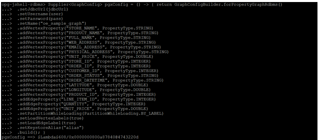
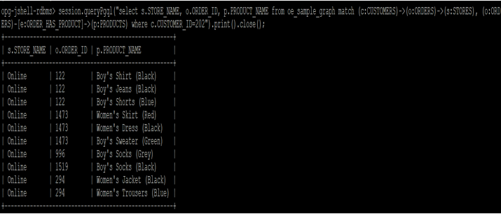
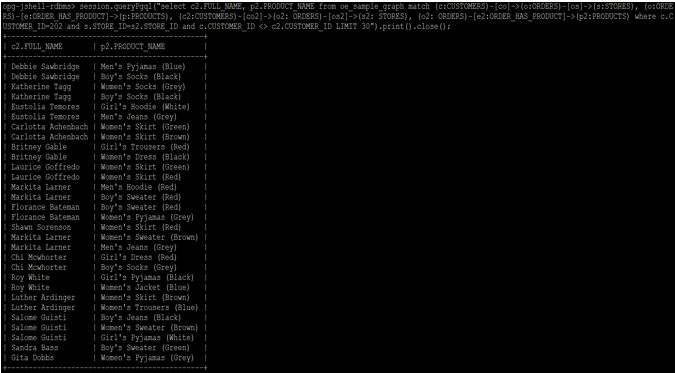

# Oracle Graph 

## Introduction
This lab will show you how to load the graph into memory and run PGQL queries against the in-memory graph. 

1.	define the graph to be loaded into memory 
2.	specify where to load the graph from and which graph
3.	specify which vertex and edge properties to load and the Java types for them

## Before You Begin

This lab assumes you have completed the following labs:
- Lab 1:  Login to Oracle Cloud
- Lab 2:  Generate SSH Key
- Lab 3:  Create Compute instance 
- Lab 4:  Environment setup
- Note :  Below steps are pre-configured in the image.
- The Oracle Graph Server and Graph Client must be installed.
- Max string size parameter should be set to extended.
- AL16UTF16 (instead of UTF8) must be specified as the NLS NCHAR CHARACTERSET.
- AL32UTF8 (UTF8) should be the default character set, but AL16UTF16 must be the NLS NCHAR CHARACTERSET.

## Step 1: Loading the Graph into memory

````
<copy>
Supplier<GraphConfig> pgxConfig = () -> { return GraphConfigBuilder.forPropertyGraphRdbms()
 .setJdbcUrl(jdbcUrl)
 .setUsername(user)
 .setPassword(pass)
 .setName("oe_sample_graph")
 .addVertexProperty("STORE_NAME", PropertyType.STRING)
 .addVertexProperty("PRODUCT_NAME", PropertyType.STRING)
 .addVertexProperty("FULL_NAME", PropertyType.STRING)
 .addVertexProperty("WEB_ADDRESS", PropertyType.STRING)
 .addVertexProperty("EMAIL_ADDRESS", PropertyType.STRING)
 .addVertexProperty("PHYSICAL_ADDRESS", PropertyType.STRING)
 .addVertexProperty("UNIT_PRICE", PropertyType.DOUBLE)
 .addVertexProperty("STORE_ID", PropertyType.INTEGER)
 .addVertexProperty("ORDER_ID", PropertyType.INTEGER)
 .addVertexProperty("CUSTOMER_ID", PropertyType.INTEGER)
 .addVertexProperty("ORDER_STATUS", PropertyType.STRING)
 .addVertexProperty("ORDER_DATETIME", PropertyType.STRING)
 .addVertexProperty("LATITUDE", PropertyType.DOUBLE)
 .addVertexProperty("LONGITUDE", PropertyType.DOUBLE)
 .addVertexProperty("PRODUCT_ID", PropertyType.INTEGER)
 .addEdgeProperty("LINE_ITEM_ID", PropertyType.INTEGER)
 .addEdgeProperty("QUANTITY", PropertyType.INTEGER)
 .addEdgeProperty("UNIT_PRICE", PropertyType.DOUBLE)
 .setPartitionWhileLoading(PartitionWhileLoading.BY_LABEL)
 .setLoadVertexLabels(true)
 .setLoadEdgeLabel(true)
 .setKeystoreAlias("alias")
 .build(); }
</copy>
````
 


Load the graph. This can take 10-15 minutes or more depending on network bandwidth

````
<copy>
var graph = session.readGraphWithProperties(pgxConfig.get()) ;
</copy>
````

Run similar PGQL queries against the in-memory graph 


**Scenario 1 : Which stores did customer with id 202 order from?**

````
<copy>
session.queryPgql("select s.STORE_NAME from oe_sample_graph match (c:CUSTOMERS)->(o:ORDERS)->(s:STORES) where c.CUSTOMER_ID=202").print().close();
</copy>
````
 


**Scenario 2 : What products did customer 202 buy?**

````
<copy>
session.queryPgql("select s.STORE_NAME, o.ORDER_ID, p.PRODUCT_NAME from oe_sample_graph match (c:CUSTOMERS)->(o:ORDERS)->(s:STORES), (o:ORDERS)-[e:ORDER_HAS_PRODUCT]->(p:PRODUCTS) where c.CUSTOMER_ID=202").print().close();
</copy>
````
 



**Scenario 3 : List the first 50 other customers who ordered from the same store(s) as customer 202**

````
<copy>
session.queryPgql("Select c.CUSTOMER_ID, c.FULL_NAME from oe_sample_graph match (b:CUSTOMERS)->(o:ORDERS)->(s:STORES)<-(o2:ORDERS)<-(c:CUSTOMERS) Where b.CUSTOMER_ID=202 and b.CUSTOMER_ID <> c.CUSTOMER_ID LIMIT 50").print().close();
</copy>
````
 


**Scenario 4 : List the first 30 products that customers ordered from the same stores as customer 202**

````
<copy>
session.queryPgql("select c2.FULL_NAME, p2.PRODUCT_NAME from oe_sample_graph match (c:CUSTOMERS)-[co]->(o:ORDERS)-[os]->(s:STORES), (o:ORDERS)-[e:ORDER_HAS_PRODUCT]->(p:PRODUCTS), (c2:CUSTOMERS)-[co2]->(o2: ORDERS)-[os2]->(s2: STORES), (o2: ORDERS)-[e2:ORDER_HAS_PRODUCT]->(p2:PRODUCTS) where c.CUSTOMER_ID=202 and s.STORE_ID=s2.STORE_ID and c.CUSTOMER_ID <> c2.CUSTOMER_ID LIMIT 30").print().close();
</copy>
````
 



**Scenario 5 : list the 10 customers who had the most product purchases in common with customer 202, see definition of qStr above or just enter qStr in the shell to see its content**

````
<copy>
qStr ;
session.queryPgql(qStr).print().close();
</copy>
````
 


It is required to have the graph loaded into memory and published before visualizing it. So before moving to the next lab , please make sure Lab-2 and Lab -3 are completed.

So, our graph is loaded into the memory, let’s publish it 

**Publish the oe sample graph**

````
<copy>
graph.publish(VertexProperty.ALL, EdgeProperty.ALL) ;
</copy>
````


## Acknowledgements
- **Authors** - Balasubramanian Ramamoorthy, Arvind Bhope
- **Contributors** - Laxmi Amarappanavar, Kanika Sharma, Venkata Bandaru, Ashish Kumar, Priya Dhuriya, Maniselvan K.
- **Team** - North America Database Specialists
- **Last Updated By** - Kay Malcolm, Director, Database Product Management, June 2020
- **Expiration Date** - June 2021

**Issues-**
Please submit an issue on our [issues](https://github.com/oracle/learning-library/issues) page. We review it regularly.


 
 
