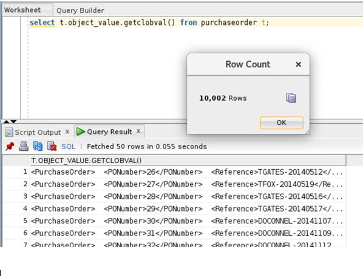

## Introduction

This lab will show you how to perform insert and update XML contents.
We can update XML content or replace either the entire contents of a document or only particular parts of a document.
The ability to perform partial updates on XML documents is very powerful, particularly when we make small changes to large documents, as it can significantly reduce the amount of network traffic and disk input-output required to perform the update.
The Oracle UPDATEXML function allows us to update XML content stored in Oracle Database.

## Before You Begin

This lab assumes you have completed the following labs:
- Lab 1:  Login to Oracle Cloud
- Lab 2:  Generate SSH Key
- Lab 3:  Create Compute instance 
- Lab 4:  Environment setup
- Note :  All scripts for this lab are stored in the /u01/workshop/xml folder and are run as the oracle user. 
  
 
## Step 1: Select xml record before Insert.
    
  ````
    <copy>
    select t.object_value.getclobval() from purchaseorder t;

     </copy>
  ````

 


## Step 2: Insert xml record
    
    
  ````
    <copy>
     Insert into purchaseorder values (' <PurchaseOrder> <PONumber>10001</PONumber>      <Reference>MSD-20200505</Reference>
         <Requestor>MS Dhoni</Requestor>     <User> TGATES </User>         <CostCenter>A50</CostCenter>         <ShippingInstructions>
         <name>MS Dhoni</name> <Address>  <street>200 Sporting Green</street><city>South San Francisco</city>
         <state>CA</state>         <zipCode>99236</zipCode>
         <country>United States of America</country> </Address>
         <Phone> <type>Office</type>
         <number>131-555-5589</number> </Phone>
         </ShippingInstructions>         <LineItems>
         <ItemNumber>1</ItemNumber>         <Part>
         <Description>Ivanhoe</Description>         <UnitPrice>19.95</UnitPrice>
         <UPCCode>66479101648</UPCCode>         </Part>
         <Quantity>2</Quantity>         </LineItems>
         <LineItems>         <ItemNumber>2</ItemNumber>
         <Part>         <Description>Karaoke: Classic Country Hits Vol. 3 203</Description>
         <UnitPrice>19.95</UnitPrice>         <UPCCode>13023003897</UPCCode>
         </Part>         <Quantity>2</Quantity>
         </LineItems>         <LineItems>
         <ItemNumber>3</ItemNumber>         <Part>
         <Description>Urban Legend</Description>         <UnitPrice>19.95</UnitPrice>
         <UPCCode>43396030916</UPCCode>         </Part>
         <Quantity>9</Quantity>         </LineItems>
         <Special_Instructions>COD</Special_Instructions>         </PurchaseOrder>
          ');
          
        </copy>
  ````
     
  

## Step 3: Verify XML record post insert
    
  ````
    <copy>
    select t.object_value.getclobval() from purchaseorder t;    
         
         </copy>
  ````
  

  
## Step 4: Update table using XML function.
    
 ````
    <copy>
    UPDATE purchaseorder
    set object_value=updateXML(OBJECT_VALUE, '/PurchaseOrder/User/text()', 'V Kholi')
     WHERE existsNode(OBJECT_VALUE, '/PurchaseOrder[Reference="MSD-20200505"]')=1;
     /
         
       </copy>
  ````
  

## Step 5:  Select XML using function
     
   ````
    <copy>

     SELECT extractValue(OBJECT_VALUE, '/PurchaseOrder/User')
       FROM purchaseorder
             WHERE existsNode(OBJECT_VALUE, '/PurchaseOrder[Reference="MSD-20200505"]') =1;
     /

     </copy>
  ````
  


## Acknowledgements

- **Authors** - Balasubramanian Ramamoorthy, Arvind Bhope
- **Contributors** - Laxmi Amarappanavar, Kanika Sharma, Venkata Bandaru, Ashish Kumar, Priya Dhuriya, Maniselvan K.
- **Team** - North America Database Specialists.
- **Last Updated By** - Kay Malcolm, Director, Database Product Management, June 2020
- **Expiration Date** - June 2021   

**Issues-**
Please submit an issue on our [issues](https://github.com/oracle/learning-library/issues) page. We review it regularly.
  