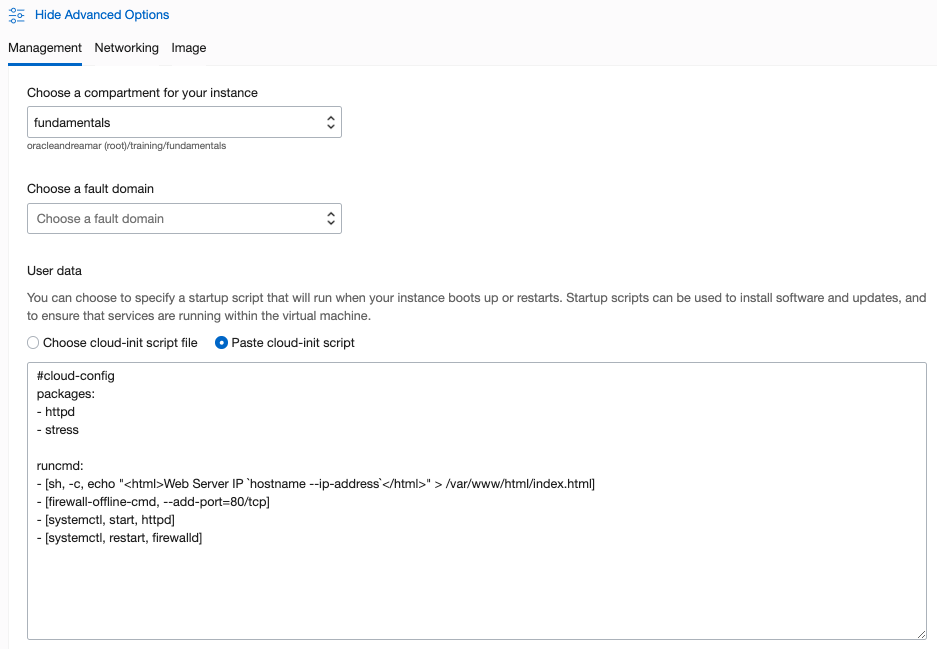
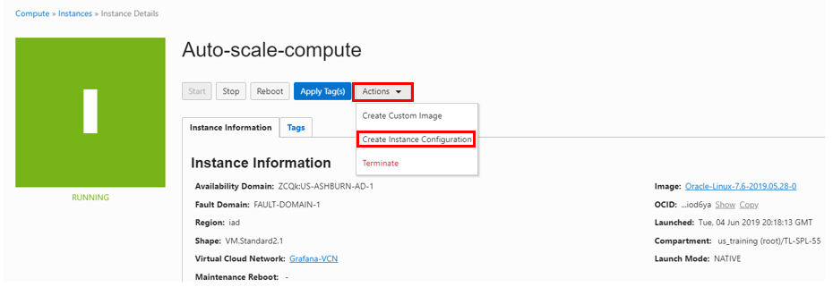
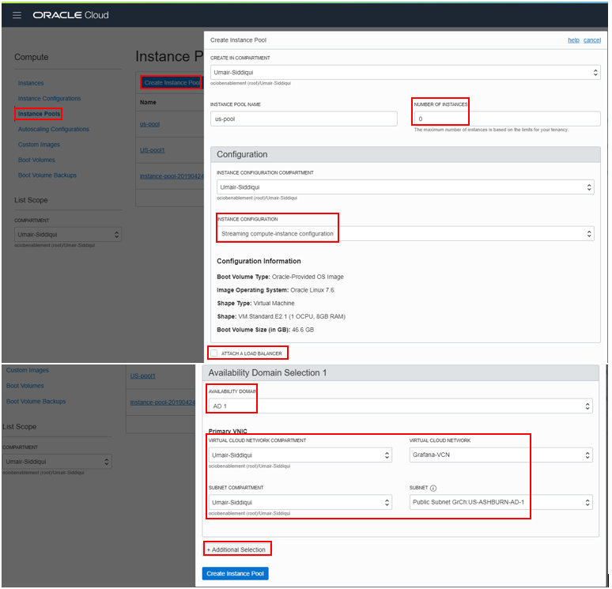
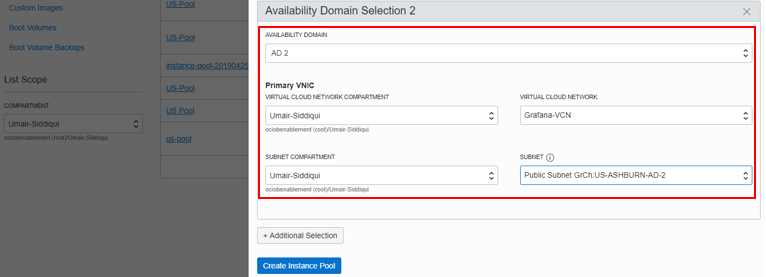
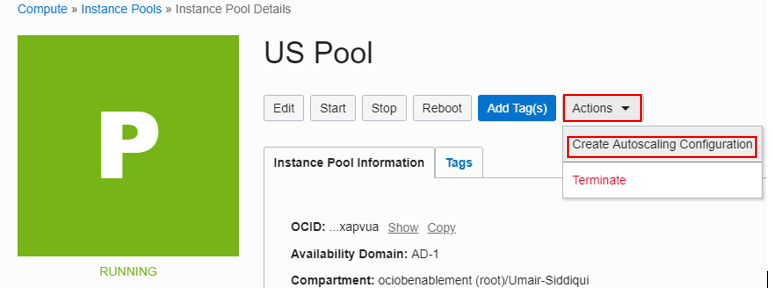
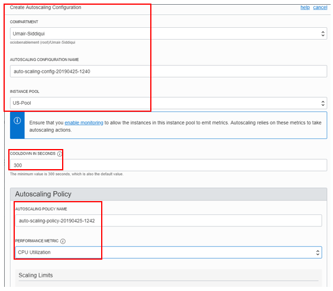
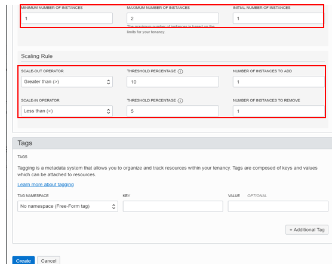
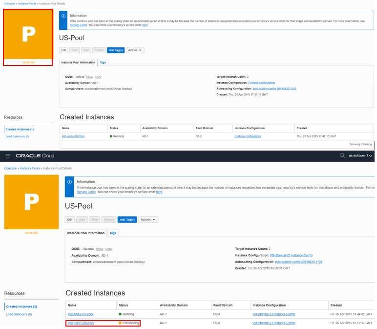

# Configuring Auto Scaling

## Introduction

In this lab we will build a load-balanced web application that can automatically scale out/in based on CPU utilization.  

We will create load balancer, compute instance, instance configuration and then configure auto scaling. We will then verify auto scaling feature as configured threshold on CPU are crossed.

Autoscaling enables you to automatically adjust the number of Compute instances in an instance pool based on performance metrics such as CPU utilization. This helps you provide consistent performance for your end users during periods of high demand, and helps you reduce your costs during periods of low demand.

You select a performance metric to monitor, and set thresholds that the performance metric must reach to trigger an autoscaling event. When system usage meets a threshold, autoscaling dynamically allocates resources in near-real time. As load increases, instances are automatically provisioned: the instance pool scales out. As load decreases, instances are automatically removed: the instance pool scales in.

Autoscaling relies on performance metrics that are collected by the Monitoring service. These performance metrics are aggregated into one-minute time periods and then averaged across the instance pool. When three consecutive values (that is, the average metrics for three consecutive minutes) meet the threshold, an autoscaling event is triggered.

A cooldown period between autoscaling events lets the system stabilize at the updated level. The cooldown period starts when the instance pool reaches a steady state. Autoscaling continues to evaluate performance metrics during the cooldown period. When the cooldown period ends, autoscaling adjusts the instance pool's size again if needed.


**Some Key points:**

*We recommend using Chrome or Edge as the broswer. Also set your browser zoom to 80%.*


- All screen shots are examples ONLY. Screen shots can be enlarged by Clicking on them

- Login credentials are provided later in the guide (scroll down). Every User MUST keep these credentials handy.

- Do NOT use compartment name and other data from screen shots. Only use  data(including compartment name) provided in the content section of the lab

- Mac OS Users should use ctrl+C / ctrl+V to copy and paste inside the OCI Console

- Login credentials are provided later in the guide (scroll down). Every User MUST keep these credentials handy.

    **Cloud Tenant Name**

    **User Name**

    **Password**

    **Compartment Name (Provided Later)**

**Note:** OCI UI is being updated thus some screenshots in the instructions might be different than actual UI

### Pre-Requisites

1. [OCI Training](https://cloud.oracle.com/en_US/iaas/training)

2. [Familiarity with OCI console](https://docs.us-phoenix-1.oraclecloud.com/Content/GSG/Concepts/console.htm)

3. [Overview of Networking](https://docs.us-phoenix-1.oraclecloud.com/Content/Network/Concepts/overview.htm)

4. [Familiarity with Compartment](https://docs.us-phoenix-1.oraclecloud.com/Content/GSG/Concepts/concepts.htm)

5. [Connecting to a compute instance](https://docs.us-phoenix-1.oraclecloud.com/Content/Compute/Tasks/accessinginstance.htm)

6. [Familiarity with Load Balancer concepts](https://docs.cloud.oracle.com/iaas/Content/Balance/Concepts/balanceoverview.htm)

## Step 1: Create VCN

* **Tenant Name:** {{Cloud Tenant}}
* **User Name:** {{User Name}}
* **Password:** {{Password}}
* **Compartment:**{{Compartment}}

**Note:** OCI UI is being updated thus some screenshots in the instructions might be different than actual UI

1. Sign in using your tenant name, user name and password. Use the login option under **Oracle Cloud Infrastructure**.
    

2. From the OCI Services menu,Click **Virtual Cloud Network**. Select the compartment assigned to you from drop down menu on left part of the screen under Networking and Click **Start VCN Wizard**.

**NOTE:** Ensure the correct Compartment is selected under COMPARTMENT list.

3. Click **VCN with Internet Connectivity** and click **Start Workflow**.

4. Fill out the dialog box:

      - **VCN NAME**: Provide a name
      - **COMPARTMENT**: Ensure your compartment is selected
      - **VCN CIDR BLOCK**: Provide a CIDR block (10.0.0.0/16)
      - **PUBLIC SUBNET CIDR BLOCK**: Provide a CIDR block (10.0.1.0/24)
      - **PRIVATE SUBNET CIDR BLOCK**: Provide a CIDR block (10.0.2.0/24)
      - Click **Next**

5. Verify all the information and  Click **Create**.

6. This will create a VCN with the following components:
   
    *VCN, Public subnet, Private subnet, Internet gateway (IG), NAT gateway (NAT), Service gateway (SG)*

7. Click **View Virtual Cloud Network** to display your VCN details.
             
## Step 2: Create Load Balancer and update Security List

*When you create a load balancer, you choose its shape (size) and specify subnets from different Availability Domains. This ensures that the load balancer is highly available.*

1. From OCI Services menu, Click **Load Balancers** under **Networking**.

2. Click **Create Load Balancer**. Fill out the dialog box;

    **Under Add Details**

    - **LOAD BALANCER NAME**: Enter a name for your load balancer.
    - **CHOOSE VISIBILITY TYPE**: Public
    - **CHOOSE THE MAXIMUM TOTAL BANDWIDTH**: Select **SMALL** 100Mbps. (This specifies the bandwidth of the load balancer.)

    ***NOTE:*** Shape cannot be changed later.

    - **VIRTUAL CLOUD NETWORK**: Choose your Virtual Cloud Network
    - **SUBNET**: Choose the **Public Subnet**

    

    Click **Next**.

    **Under Choose Backends:**

    - **SPECIFY A LOAD BALANCING POLICY**: Weighted Round Robin
    - **Add Backends**: Don't add any backend. This will be managed by the instance pool. 

    

    **Under SPECIFY HEALTH CHECK POLICY**

    - **PROTOCOL**: HTTP
    - **Port**: 80 
    - **URL PATH (URI)**: /

        *Leave other options as default*

        Click **Next**.

    **Under Configure Listener**

    - **SPECIFY THE TYPE OF TRAFFIC YOUR LISTENER HANDLES**: HTTP
    - **SPECIFY THE PORT YOUR LISTENER MONITORS FOR INGRESS TRAFFIC**: 80

        *Leave other options as default*

3. Click **Create Load Balancer** .

4. Wait for the load balancer to become active and then note down it’s Public IP address.

5. From OCI Services menu, Click **Virtual Cloud Network** under Networking. Locate the VCN you created earlier.

6. Click VCN name to display VCN detail page.

7. Click **Security Lists**, and locate the Default Security List.

8. Click **Default Security List**, Click **Add Ingress Rule**.
Enter the following ingress rule; Ensure to leave STATELESS flag un-checked

      - Source Type: CIDR 
      - Source CIDR: Enter 0.0.0.0/0.
      - IP Protocol: Select TCP.
      - Source Port Range: All.
      - Destination Port Range: Enter 80 (the listener port).

9. Click **Add Ingress Rule**. 

## Step 3: Configure instance pool and auto scaling

1. Configure instance pool requires creating a instance configuration. First we will create ssh keys and a compute instance to create instance configuration. 
Click the Apps icon in the toolbar and select  Git-Bash to open a terminal window.
    

2. Enter command 
    ```
    <copy>
    ssh-keygen
    </copy>
    ```
    **HINT:** You can swap between OCI window, 
    git-bash sessions and any other application (Notepad, etc.) by Clicking the Switch Window icon.
    

3. Press Enter When asked for 'Enter File in which to save the key', 'Created Directory, 'Enter passphrase', and 'Enter Passphrase again.
    

4. You should now have the Public and Private keys:

    /C/Users/ PhotonUser/.ssh/id_rsa (Private Key)

    /C/Users/PhotonUser/.ssh/id_rsa.pub (Public Key)

    **NOTE:** id\_rsa.pub will be used to create 
    Compute instance and id_rsa to connect via SSH into compute instance.

    **HINT:** Enter command 
    ```
    <copy>
    cd /C/Users/PhotonUser/.ssh </copy>(No Spaces) 
    ```  
    and then 
    ```
    <copy>
    ls 
    </copy>
    ```  
    to verify the two files exist. 

5. In git-bash Enter command  
    ```
    <copy>
    cat /C/Users/PhotonUser/.ssh/id_rsa.pub
    </copy>
    ```
    , highlight the key and copy 
        

6. Click the apps icon, launch notepad and paste the key in Notepad (as backup).
    

7. Switch to the OCI console. From OCI services menu, Click **Instances** under **Compute**.

8. Click **Create Instance**. Fill out the dialog box:

      - **Name your instance**: Enter a name 
      - **Choose an operating system or image source**: For the image, we recommend using the Latest Oracle Linux available.
      - **Availability Domain**: Select availability domain
      - **Instance Type**: Select Virtual Machine 
      - **Instance Shape**: Select VM shape 


      ***Under Configure Networking***
      - **Virtual cloud network compartment**: Select your compartment
      - **Virtual cloud network**: Choose the VCN 
      - **Subnet Compartment:** Choose your compartment. 
      - **Subnet:** Choose the Public Subnet under **Public Subnets** 
      - **Use network security groups to control traffic** : Leave un-checked
      - **Assign a public IP address**: Check this option

      

      - **Boot Volume:** Leave the default
      - **Add SSH Keys:** Choose 'Paste SSH Keys' and paste the Public Key saved earlier.

9. Click  **Show Advanced Options**.

    ***Under Management***

    - **User Data**: Choose '*Paste cloud-init script*' and paste the below script. Cloud-init script will be executed at the first boot only to configure the instance. 

    ```
    <copy>
    #cloud-config
    packages:
    - httpd
    - stress

    runcmd:
    - [sh, -c, echo "<html>Web Server IP `hostname --ip-address`</html>" > /var/www/html/index.html]
    - [firewall-offline-cmd, --add-port=80/tcp]
    - [systemctl, start, httpd]
    - [systemctl, restart, firewalld]
    </copy>
    ```

    

10. Click **Create**.

    **NOTE:** If 'Service limit' error is displayed choose a different shape such as VM.Standard.E2.2 OR VM.Standard2.2 OR choose a different AD.

    

11. Wait for Instance to be in **Running** state. 

12. Click Instance name and then select **Create Instance Configuration** from the Action menu.  
Fill out the dialog box:

    


    **CREATE IN COMPARTMENT**: Choose your compartment

    **INSTANCE CONFIGURATION NAME** : Provide a name

13.  Click **Create Instance Configuration**.

14.  In the Instance Configuration page, Click **Create Instance Pool**.

    

15.  Click **Create Instance Pool**. A new dialog box will appear. This is used to create initial configuration of the instance pool such as how many compute instance to create initially, VCN, and Availability domain the instance pool should be created in. Fill out the dialog box:

    - **CREATE IN COMPARTMENT**: Choose your compartment
    - **INSTANCE POOL NAME**: Provide a suitable name
    - **NUMBER OF INSTANCES**: 0 

    (This is the number of computes that should be launched when the pool is created. We will start with no compute)

    - **INSTANCE CONFIGURATION COMPARTMENT** : Provide your compartment

    (This is the compartment where instance configuration will be placed and can only be used in this specific compartment)


    - **INSTANCE CONFIGURATION**: Choose the instance configuration created earlier

    (Any computes launched in this pool will inherit shape, image and ssh keys of the compute whose instance configuration we are using)

    - **ATTACH A LOAD BALANCER**: Select this option.

    - **LOAD BALANCER COMPARTMENT**: Choose your compartment

    - **LOAD BALANCER**: Choose the Load Balancer created earlier

    - **BACKEND SET**: Choose the first backend set

    - **PORT**: 80

    - **VNIC**: Leave the default


    - **AVAILABILITY DOMAIN**: Choose the AD you want to places instances (you can choose first AD if in Multi AD region)
    - **VIRTUAL CLOUD NETWORK COMPARTMENT**: Choose VCN's compartment
    - **VIRTUAL CLOUD NETWORK**: Choose your VCN
    - **SUBNET COMPARTMENT**: Choose your compartment

    - **SUBNET**: Choose the Public Subnet  

    *NOTE: Below step of adding second AD only applies if you are working in Multi AD Region. This step should be skipped for Single AD Region.*

16. Click **+ Additional Selection** and select a different availability domain for the instance pool. Then, specify the VCN details for the second availability domain.

    - We configured instances to be deployed in two different Avaialability domain though they can be deployed in the same Availability domain as long as service limits allow it.

    - For this lab use two different availability domains.

    

    

17. Click **Create Instance Pool**. Wait for Instance Pool to be in **RUNNING** state (turns green).

18. From the instance pool details page, Click **Actions** and choose **Create Auto Scaling Configuration**.
    

19. Fill out the dialog box:

    - **COMPARTMENT**: Choose your compartment
    - **AUTOSCALING CONFIGURATION NAME** : Provide a name
    - **INSTANCE POOL** : This should show your instance pool name created earlier
    - **COOLDOWN IN SECONDS** : 300 (This is he minimum period of time between scaling actions.)
    - **AUTOSCALING POLICY NAME** : Provide a name
    - **PERFORMANCE METRIC** : CPU Utilization (This is the Metric to use for triggering scaling actions.)
    - **MINIMUM NUMBER OF INSTANCES** : 1 (this is the minimum number of instances that the pool will always have)
    - **MAXIMUM NUMBER OF INSTANCES** : 2 (this is the maximum number of instances that the pool will always have)
    - **INITIAL NUMBER OF INSTANCES** : 1 (this is how many instances will be created in the instance pool initially)
    - **SCALE-OUT OPERATOR** : Greater than (>)
    - **THRESHOLD PERCENTAGE** : 10
    - **NUMBER OF INSTANCES TO ADD** : 1
    - **SCALE-IN OPERATOR** : Less than (<)
    - **THRESHOLD PERCENTAGE** : 5
    - **NUMBER OF INSTANCES TO REMOVE**  : 1

    *Leave other fields as is.*

20. Click **Create**.
    

    

    We have now created a auto scaling policy that will start with creating 1 compute instance in the designated pool. Once the CPU utilization is determined to be above 10% for at least 300 seconds another compute instance will be launched automatically. Once the CPU utilization is determined to be less than 5% for 300 seconds, one compute instance will be removed. At all times there will be at least 1 compute instance in the pool.

    *Original image can be deleted as it's not part of the pool.*

## Step 4: Test the setup

1. Click **Instance Pools** under **Compute** and then your pool name. You should see a Compute instance created. Click the Compute Instance name.
    

2. Note down the Public and Private IP of compute instance from the details page (Under **Primary VNIC Information** section). 

3. Open a web browser and enter load balancer's public IP address. You should see the message: `Web Server IP: <instance private IP>`

4. Switch to git bash window, if the ssh session to compute instance is still open then exit out of the session (quit command). 

5. Ensure you are in /C/Users/PhotonUser/.ssh directory.

6. Enter **ls** and verify id_rsa file exists.

7. Enter command: 
    ```
    <copy>
    bash
    ssh -i id_rsa_user opc@<PUBLIC_IP_OF_COMPUTE>
    </copy>
    ```

    **HINT:** If 'Permission denied error' is seen, ensure you are using '-i' in the ssh command

8. Enter 'Yes' when prompted for security message
    
 
9. Now start CPU stress, Enter command:

    ```
    <copy>
    sudo stress --cpu 4 --timeout 350
    </copy>
    ```

    *Spawn 4 workers spinning on sqrt() with a timeout of 350 seconds.*

10. Switch back to OCI console and navigate to Instance pool details page. Click your instance name and scroll down to **Metric** screen, you should see CPU spiking up after a minute or so.
    

11. Navigate to your Instance Pool details page. In about 3-4 minutes (time configured when we created auto scale configuration), status of Pool should change to **Scaling** and a second compute instance should launch.
    

    *This is since our criteria of CPU utilization > 10 was met.*

12. When the second instance is up and running and the instance pool status is  'Running', switch to the web browser and refresh the page multiple times and observe the load balancer balancing traffic between the two web servers.

13. Switch back to git bash window and if the stress tool is still running, Prees Ctrl + C to stop the script.

14. Switch back to OCI console window and navigate to your compute instance details page. Verify CPU utilization goes down after a minute.

15. Navigate to Instanse pool details page and after 3-4 minute Instance pool status will change to **Scaling** . Additional compute instance will be deleted. 

    *This is because our criteria of CPU utilization < 5 is met.*

## Step 5: Delete the resources

1. Switch to  OCI console window.

2. If your Compute instance is not displayed, From OCI services menu Click **Instances** under **Compute**.

3. Locate first compute instance, Click Action icon and then **Terminate**.
    

4. Make sure Permanently delete the attached Boot Volume is checked, Click Terminate Instance. Wait for instance to fully Terminate.
    

5. In OCI console window from Instance Pool Details page, Click **Terminate** under **Action**. Provide Instance Pool name in the pop up dialog box and Click **Terminate**. This will delete the pool along with the compute instance and auto scale configuration.
    

6. Navigate to **Instance Configurations** Under **Compute**. For your Instance Configuration, Click **Delete** under the three Vertical dots.
    

7. Navigate to **AutoScaling Configurations** Under **Compute**. For your Instance Configuration, Click **Delete**.

8. From OCI services menu Click **Load Balancers** under Networking, locate your Load Balancer and Click Terminate under the three Vertical dots.

9. From OCI services menu Click **Virtual Cloud Networks** under Networking, Locate your VCN , Click Action icon and then **Terminate**. Click **Delete All** in the Confirmation window. Click **Close** once VCN is deleted.
    


## Acknowledgements
*Congratulations! You have successfully completed the lab.*

- **Author** - Flavio Pereira, Larry Beausoleil
- **Adapted by** -  Yaisah Granillo, Cloud Solution Engineer
- **Last Updated By/Date** - Yaisah Granillo, May 2020
- **Expiration Date** - ?

See an issue?  Please open up a request [here](https://github.com/oracle/learning-library/issues).   Please include the workshop name and lab in your request. 